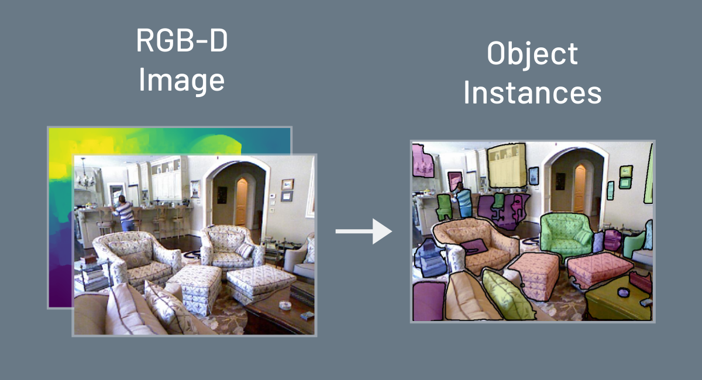

# Object Instance Segmentation from RGB-D Data with Mask R-CNN

This is an extended implementation of matterport's [Mask R-CNN](https://github.com/matterport/Mask_RCNN) implementation on Python 3, Keras, and TensorFlow that supports RGB-D input data. The model generates bounding boxes and segmentation masks for each instance of an object in the RGB(-D) image. It's based on Feature Pyramid Network (FPN) and a ResNet101 backbone.

In our experiments we showed that an additional depth input layer can improve the segmentation accuracy of Mask R-CNN by up to 31%.

Links: [Presentation](https://drive.google.com/file/d/1otA-GDfS-7KHopIVa8kvhq6R2vQh8dGX/view), [Paper](https://drive.google.com/file/d/1jngkyHaAs9gxZNe6l0xQHnCDeZzjOQ1T/view) (unofficial CoRL 2018 submission)

Training and evaluation scripts for the [2D-3D-S](https://github.com/alexsax/2D-3D-Semantics), [ADE20K](https://groups.csail.mit.edu/vision/datasets/ADE20K/), Coco, [NYU Depth V2](https://cs.nyu.edu/~silberman/datasets/nyu_depth_v2.html), [sceneNet](https://arxiv.org/abs/1511.07041) and [sceneNN](http://103.24.77.34/scenenn/home/) datasets can be found under the [instance_segmentation](instance_segmentation/) directory:

- `dataset.py`: Hyperparameters config, interface to datasets

- `train.py`: Training script

- `eval.ipynb`: IPython notebook for the evaluation of the dataset & training

Please refer to [Matterport's original implementation](https://github.com/matterport/Mask_RCNN) for the original documentation and more.
